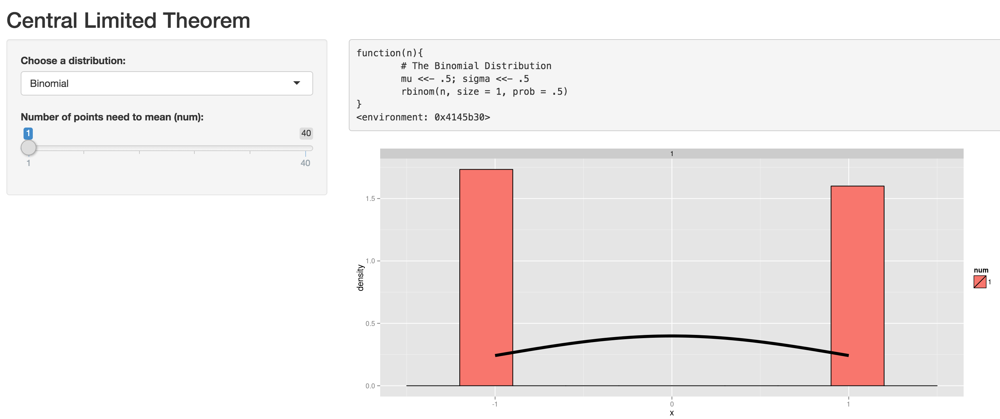

## Investigate Central Limited Theorem  

* This [shiny app](https://adalee.shinyapps.io/central_limited_theorem) investigate the [Central Limited Theorem](https://en.wikipedia.org/wiki/Central_limit_theorem). The central limit theorem (CLT) states that, given certain conditions, the arithmetic mean of a sufficiently large number of iterates of independent random variables, each with a well-defined expected value and well-defined variance, will be approximately normally distributed, regardless of the underlying distribution

* So we investigate some distribution and see how the CLT works, distribution contains Binomial, Exponential, F, Logistic, Poisson, Student T, Uniform distribution. 

* We create 1000 mean datas from specific distribution and see its normalized distribution in hist, we also plot a normal distribution curve to see how they are similar, when num = 1, this means we create 1000 random data from that distribution, when num = 40, this means we create 1000 random data mean of 40 data from that distribution.

---

## Binomial Distribution Example

```{r}
binom <-  function(n){ rbinom(n, size = 1, prob = .5) } # The Binomial Distribution
```

```{r echo=FALSE}
# num = 1
samples <- NULL
num <- 1
mu <- .5; sigma <- .5
for (i in 1:1000) samples <- c(samples, mean(binom(num)))
library(ggplot2)
normalize_mean <- function(x, mu, sigma, n){sqrt(n) * (x - mu) / sigma}
dat <- data.frame(
        x = sapply(samples, normalize_mean, mu, sigma, n = num),
        num = factor(rep(num, 1000)))
g <- ggplot(dat, aes(x = x, fill = num)) + geom_histogram(binwidth=.3, colour = "black",
                                                           aes(y = ..density..)) 
g <- g + stat_function(fun = dnorm, size = 2)
g1 <- g + facet_grid(. ~ num)

# num = 40
samples <- NULL
num <- 40
for (i in 1:1000) samples <- c(samples, mean(binom(num)))
library(ggplot2)
normalize_mean <- function(x, mu, sigma, n){sqrt(n) * (x - mu) / sigma}
dat <- data.frame(
        x = sapply(samples, normalize_mean, mu, sigma, n = num),
        num = factor(rep(num, 1000)))
                
g <- ggplot(dat, aes(x = x, fill = num)) + geom_histogram(binwidth=.3, colour = "black",
                                                           aes(y = ..density..)) 
g <- g + stat_function(fun = dnorm, size = 2)
g2 <- g + facet_grid(. ~ num)

# plot two
library(gridExtra)
grid.arrange(g1, g2, ncol=2)

```

---

## How to use the shiny app

* From Binomial example, we can see that Binomial Distribution does not violate Central Limited Theorem. You can explore other distributions on the [shiny app](https://adalee.shinyapps.io/central_limited_theorem)

* First choose distribution, for example "Binomial", and choose num = 1, this will see the original distribution of "Binomial" distribution



---

## How to use the shiny app

* Second choose distribution, for example "Binomial", and choose num = 40, this will see the 40 mean distribution of "Binomial" distribution, we can see that this fit the normal distribution curve very well. 


* You can try other distributions by yourself [here](https://adalee.shinyapps.io/central_limited_theorem). Since the program runs for a few seconds, so you may need patient to wait for a few seconds.